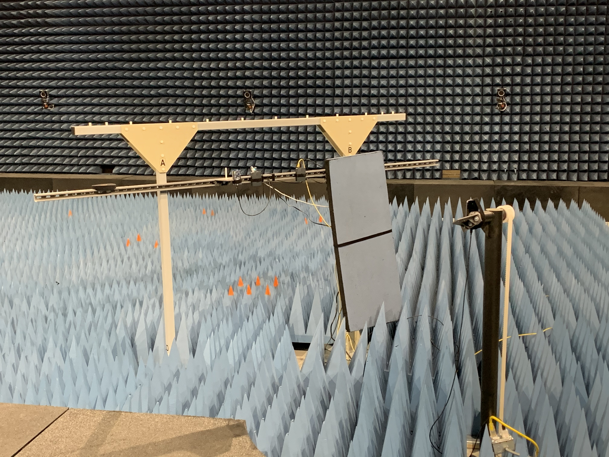

# KRI Anechoic Chamber Dataset

## Data files
Each data collection consists of multiple file types.  The CSV files following the format below, a raw Wireshark pcapng file containing raw BTLE packets, and text files containing calculated statistics on the associated dataset.

## Data format
All data is formatted using a modified MITLL CSV format as follows:

[Timestamp (YYYY-MM-DD hh:mm:ss.ffffff)],[Data ID*],[BTLE Addr (MAC Addr)],[RSSI (dBm)],[Tx Power (dBm)],[Seconds Since Epoch],[BTLE Chan (37,38,39)]

*Data format can be: "Environment", "Device", "Range", "Angle", "TxPower", "GPS", "Bluetooth"

## Collected Data
All data was collected using the nRF52 BTLE Sniffer and a custom program (located at https://github.com/klingm/btle_sniffer). The following data collection are included in the nRF52 folder:

- iPhone 11-1
- iPhone 11-2
- iPhone 11-3
- Samsung Galaxy S10-1
- Samsung Galaxy S10-2
- Samsung Galaxy S10-3
- Samsung Galaxy S7-1
- Samsung Galaxy S7-2
- Samsung Galaxy S7-3

Each "-1" recording was performed with the Nordic Semi nRF52 BLTE Sniffer set up on tripod 6 feet from antenna mast holding phone.  Data collected with both devices stationary in 45 degree increments around horizontal axis. Two additional data collections done with phone being rotated around horizontal and then veritical axes; data continuously collected during rotations.

This was an initial attempt at collecting data however it was discovered that the tripod was contributing to some unwanted variability in the data due to a metallic core.  Subsequent captures were redone with a full fiberglass support frame used to mount the BLTE sniffer.

The "-2" and "-3" recordings were both done with the new fiberglass support frame for the BLTE sniffer at 6ft ("-2") and 12ft ("-3") distances.

